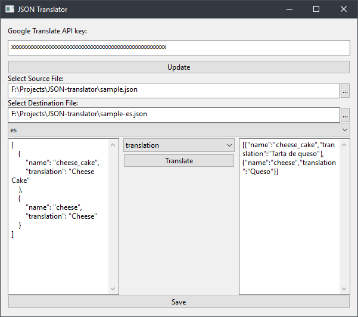

<h1 class="title">Building a Desktop UI in Go</h1>
<h2 class="subtitle">Is it a good idea?</h2>
2017-09-21

I started my career as a Software Developer building iOS apps. I had a passion for crafting user interfaces that had been realized in college when I leaned heavily towards the menu building portion of a 2D game I was writing at the time. As time moved on I found myself doing more and more web UI’s , which makes sense, that is the way things are heading, especially in the enterprise.

After some [tinkering with Go](https://medium.com/from-the-couch/adventures-in-go-ba217c29b51d) however I was eager to give desktop development another shot, since it’s really easy to get things up and running in the language. Browsing through the GUI section in awesome-go lists a few options, which can be boiled down to the few technologies that the list of libraries is actually built on top of.

- HTML/CSS electron like stuff
- GTK
- Qt
- Windows only stuff
- Libui

Immediately I wrote off the Windows only library. Not because I dislike Windows, or don’t run it, in fact the machine I’m typing this on is a Windows machine, and my app would probably more than likely be used on a Windows box. The problem I have is that I firmly believe that new desktop software should without question run on at least macOS, Windows and Linux. As a user who swaps OS quite frequently I would like to have a familiar tool that I can take with me, so that forms part of the decision when I choose to buy in to a piece of software, let alone pay for it.

Anyway, that was a little tangential, my point is, I did not want to write an application for only one platform, and I don’t think that is a ridiculous ask in 2017.

When it comes to the HTML stuff. I’m not really a fan when it comes to building desktop apps using web technologies. I won’t even attempt that tangent here, but let’s just say I think the web should be the web and the desktop should be the desktop. I may stretch to use it if the scenario makes sense, but for me, in this instance, it did not.

I dismissed GTK purely out of ignorance, although I had played with it in the past in Linux, I felt that it may be a little bit of a heavy dependency on the other platforms, I may be wrong about that but I thought I would give this one a miss out of intuition.

Now, let’s talk about Qt. I have used it with success before in C++ using Qt creator, but that was very long ago. A time when things were less confusing and the project was actually run by Nokia. Just finding the download link for the “Open Source” Qt SDK was a nightmare, and while I was walking through the valley shadowed with “Buy” buttons I could not help but wonder how Open Source Qt really is these days, it certainly did not make me feel comfortable with using the thing. And that’s coming from someone who until very recently wasn’t that bothered by the React license.

Dodgy websites aside, there is another problem with Qt. Once I got the already quite large Windows Installer onto my machine and pointed it at a directory in which to throw itself. It complained that there was not enough space; Qt had threatened to take up 30GB of space! 30 GB! This is insane, what are we running a copy of Shadow of Mordor behind every button?

>

Behind every QButton lies a hero

Needless to say, I was not impressed. On top of that the experiences I had had with go up to this point led me to believe that there should be an easier way

The libui based library “ui” is by far the quickest way to get a window to show up that’s written in Go. It’s based on a cross platform C library from the same author and all you have to do to set it up is use “go get”. Not all is sunshine and roses though. I initially set up the project on my Windows machine at home and everything seemed fine. But when I tried to run it on my MacBook Pro, things went a little crazy.

At this point, it may help to clarify what I was actually trying to build. Since I am new to Go, I wanted to build something simple, I’m also not trying to make the next big thing. Just a [simple tool](https://github.com/divanvisagie/json-translator) that translates certain values in a JSON file that may make my life easier when it comes to testing translations.

After spending some time with a [colleague](https://medium.com/@stvndall) trying to figure out why the JSON would not render until the window was resized in what at the time was just a label for testing, we decided to try it on his Ubuntu machine… it worked just fine.

My current version of the software now uses a multi-line “Entrybox”, which I was only able to achieve thanks to a fork of “ui” that got a little impatient. The main project is promising to resolve this and get the Multi-line control in , and I’m banking on that for my macOS support because right now that fork doesn’t seem to really work at all.

Anyway here is a great example of what the thing is supposed to look like and does on 2/3 operating systems.

Right now , I would not call it the most complete application. I still have yet to solve the problem of unloading the options from the dropdown key selector without completely destroying them and wrecking my layout. The library was a good way to get started, but it looks like it still has a lot of work before it competes with something like QT.

The real practical question that I have from all of this is, if the UI libraries just aren’t there. Does it make sense to build a desktop application in this language?

Well like I said, I just started getting back into this, and a lot has changed. My next point of investigation will be attempting something similar in Kotlin, which means I will have the heritage of the Java ecosystem on my side, It seems to be working for JetBrains.