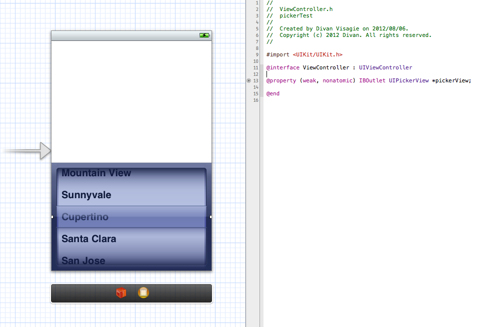
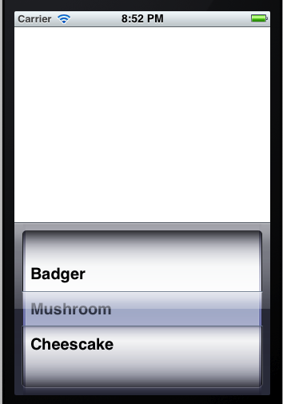

<h1 class="title">Creating a custom UIPickerView</h1>
<h2 class="subtitle"></h2>
<span class="date">2012-08-06</span>

In this tutorial I will create a simple iPhone app to demonstrate how one would create a UIPickerView with custom contents. I started by creating a single view iPhone app (If you are not familiar with this I suggest you read [this](http://divcode.blogspot.com/2012/07/beginning-ios-development.html)).

Note: I always use Automatic Reference Counting unless specified otherwise.

Ok, lets jump right in and add a Picker View to the View on the storyboard and link it up to the ViewController.h file:



Now lets make sure that ViewController is part of the UIPicker protocols:

```objc
#import <UIKit/UIKit.h>

@interface ViewController : UIViewController <UIPickerViewDelegate,UIPickerViewDataSource>

@property (weak, nonatomic) IBOutlet UIPickerView *pickerView;

@end
```

Now lets switch to ViewController.m and do the rest of the work.

First lets set up an array to store some of our list items in, we do this in the private interface:

```objc
@interface ViewController (){
    NSMutableArray *listItems;
}
@end
```

Now go to the viewDidLoad function so we can give pickerView some settings, we set the dataSource and delegates to be self and set some other settings. Here we will also populate our array with some names:

```objc
- (void)viewDidLoad
{
    [super viewDidLoad];
    pickerView.delegate = self;
    pickerView.dataSource = self;
    pickerView.showsSelectionIndicator = YES;
    pickerView.opaque = NO;
    listItems = [[NSMutableArray alloc] initWithObjects:@"Badger",@"Mushroom",@"Cheescake" ,nil];
}
```

Next we Implement the Picker Delegate methods that will populate the pickers list. First is numberOfComponents... which returns the amount of "Columns" that the picker will contain, in this case only one.

```objc
-(NSInteger)numberOfComponentsInPickerView:(UIPickerView *)pickerView{
    return 1;
}
```

Next is the method that returns the amount of items that will be in the list, so naturally we return the array count:

```objc
-(NSInteger)pickerView:(UIPickerView *)pickerView numberOfRowsInComponent:(NSInteger)component{
    return listItems.count;
}
```

And Finally the method that will return the actual entry displayed in the pickerView:

```objc
-(NSString*)pickerView:(UIPickerView *)pickerView titleForRow:(NSInteger)row forComponent:(NSInteger)component{
    return [listItems objectAtIndex:row];
}
```

Now just hit run and you should get the following result:



And for those of you who just want the source, here it is:

**ViewController.h:**

```objc
//
//  ViewController.h
//  pickerTest
//
//  Created by Divan Visagie on 2012/08/06.
//  Copyright (c) 2012 Divan. All rights reserved.
//

#import <UIKit/UIKit.h>

@interface ViewController : UIViewController <UIPickerViewDelegate,UIPickerViewDataSource>

@property (weak, nonatomic) IBOutlet UIPickerView *pickerView;

@end
```

**ViewController.m:**

```objc
//
//  ViewController.m
//  pickerTest
//
//  Created by Divan Visagie on 2012/08/06.
//  Copyright (c) 2012 Divan. All rights reserved.
//

#import "ViewController.h"

@interface ViewController (){
    NSMutableArray *listItems;
}
@end

@implementation ViewController

@synthesize pickerView;

- (void)viewDidLoad
{
    [super viewDidLoad];
    pickerView.delegate = self;
    pickerView.dataSource = self;
    pickerView.showsSelectionIndicator = YES;
    pickerView.opaque = NO;
    listItems = [[NSMutableArray alloc] initWithObjects:@"Badger",@"Mushroom",@"Cheescake" ,nil];
}

- (void)viewDidUnload
{
    [self setPickerView:nil];
    [super viewDidUnload];
    // Release any retained subviews of the main view.
}

- (BOOL)shouldAutorotateToInterfaceOrientation:(UIInterfaceOrientation)interfaceOrientation
{
    return (interfaceOrientation != UIInterfaceOrientationPortraitUpsideDown);
}

#pragma mark - Picker Methods -

-(NSInteger)numberOfComponentsInPickerView:(UIPickerView *)pickerView{
    return 1;
}

-(NSInteger)pickerView:(UIPickerView *)pickerView numberOfRowsInComponent:(NSInteger)component{
    return listItems.count;
}

-(NSString*)pickerView:(UIPickerView *)pickerView titleForRow:(NSInteger)row forComponent:(NSInteger)component{
    return [listItems objectAtIndex:row];
}

@end
```

Note on wrapping: The UIPickerView is actually a glorified UITableView in a sense meaning that the "Spin Box" will not wrap automatically. This will require you to perform your own additional logic to get the job done [if a spinbox is the look you are going for](http://forums.macrumors.com/showthread.php?p=6120638&highlight=UIPickerView#post6120638).

---

*Originally posted on [Blogspot](https://divcode.blogspot.com/2012/08/creating-custom-uipickerview.html)*
