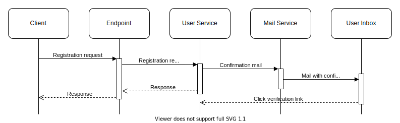
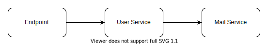
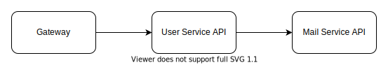
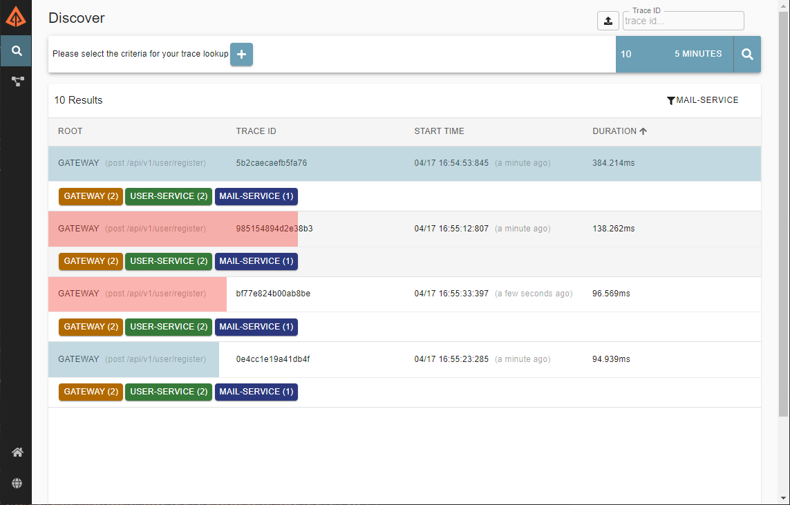
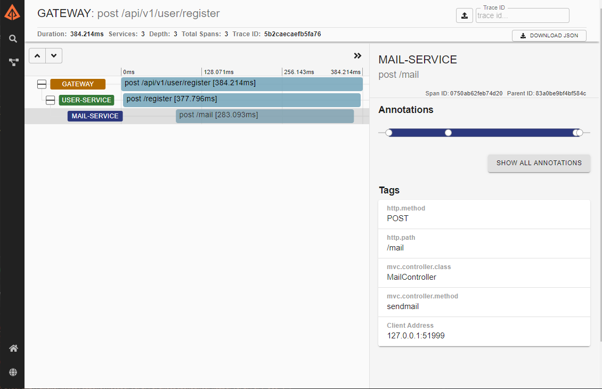
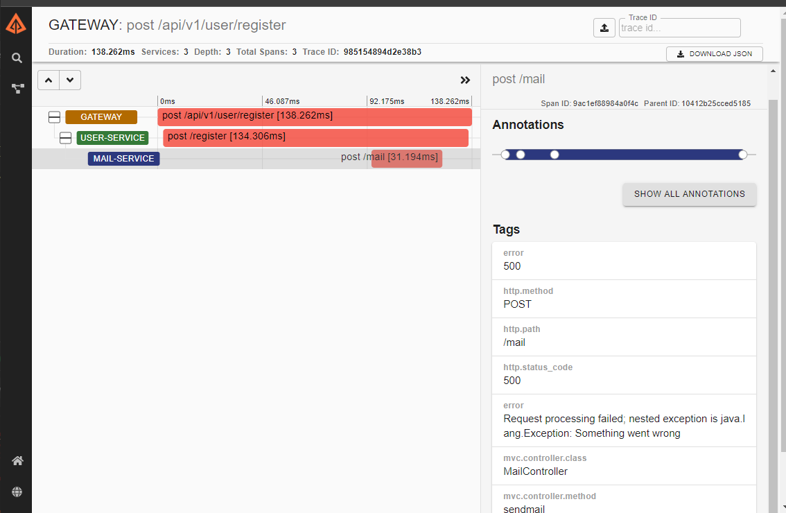
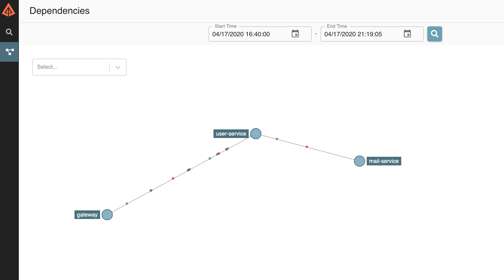
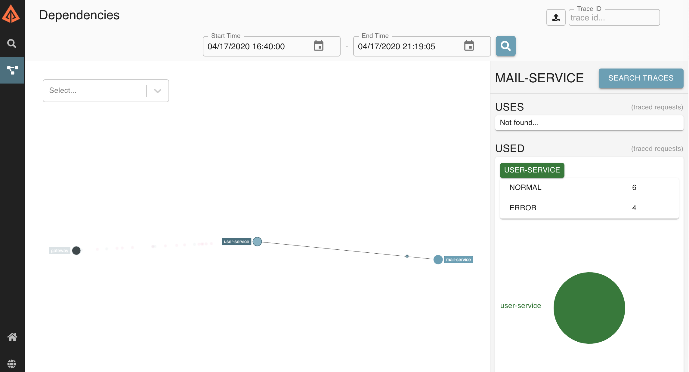

<h1 class="title">Distributed Request Tracing</h1>
<h2 class="subtitle">Debugging across services</h2>
<span class="date">2020-04-18</span>


When working with traditional monolithic applications, you can very quickly become used to a certain style of debugging when something has gone wrong. Logs can reveal quite a lot on their own and the logs for each request may even [have a unique identifier](https://medium.com/@d.lopez.j/spring-boot-setting-a-unique-id-per-request-dd648efef2b) so that you can track down what went wrong with a particular request. If that fails, assuming you can replicate your issues on your developer environment, you can simply attach a debugger and watch for when the flow breaks.

Microservices on the other hand make the problem of debugging much more complicated. When a single request from a user passes through mutliple applications, tracking down where exactly that request went wrong can become a nightmare, even with the same tooling that was such a breeze with our monolith.

## Monolithic Example
Let's take the example of a user registration flow for a monolithic application. When the client registers, an email should be sent to them to verify their email address.



Internally this application consists of three parts, each layer calling the next:




These internals are very simple, but critically, each layer is still running in the same process, this makes debugging easy because we only have a single place where we need to check the logs.

Lets imagine we run into the scenario where users are reporting that registrations are failing, we can simply look at the logs of our application:

```java
08091 INFO  c.d.tracing.RegistrationController   : Calling method on user service
08091 INFO  com.divanvisagie.tracing.UserService : Calling method on mail service
09129 INFO  c.d.tracing.RegistrationController   : Calling method on user service
09129 INFO  com.divanvisagie.tracing.UserService : Calling method on mail service
09129 ERROR com.divanvisagie.tracing.UserService : An error ocurred while sending the mail.
```

Looking at the above logs gives us a lot of information about our bug and where it lives, `08091` and `09129` uniquely identify seperate requests, we are able to see that `08091` completed successfully while `09129` logged an error, our log even tells us which class this error ocurred in: `com.divanvisagie.tracing.UserService` and that it occurs just after the mail service gets called.

If we go and open up that class in our application we can have a look:

```java

@Service
public class UserService {

    @Autowired
    private MailService mailService;

    private Logger logger = LoggerFactory.getLogger(UserService.class);

    public void registerUser() {
        try{
            logger.info("Calling method on mail service");
            mailService.sendMail();
        } catch (Exception e) {
            logger.error("An error ocurred while sending the mail.", e.getMessage());
        }
    }
}
```

Let's go look at that sendMail function and see what it's doing:

```java

@Service
public class MailService {
    private boolean shouldBreak = true;

    public void sendMail() throws Exception {
        shouldBreak = !shouldBreak;
        if (shouldBreak) {
            throw new Exception("An evil programmer broke every second request");
        }
    }
}
```

Well well, mystery solved. We can now remove the evil programmers naughty code and push the fix to production, but what would have happened if our application was split up into microservices?

## Microservices Example

You will notice that our flow is exactly the same, with the exception that our components are now distributed across the network.


The following diagram now represents our network rather than the internals of our application, with each line representing a network call.



Given that everything has stayed the same and our Services have merely had the word 'API' appended to them, we would expect that debugging our registration problem would be the same as before right?

Well not quite. You see, we now have to check the logs of all three applications starting with our *Gateway* and working up to the *Mail Service*. Even then we may not find the answer, the thing about microservices is that the network now becomes an integral part of your application. A failed registration at it's extreme could even mean that someone at the datacenter tripped over the lan cable that links the *Gateway* to our *User Service*, or the *User Service* to the *Mail Service*. Furthermore this is a trivial example, some systems can have a rediculous amount of microservices which makes checking the logs of every one an impossible task, our previous solution simply doesn't scale.

## Distributed Tracing

This problem was exactly the one that Google was trying to solve when they came up with the concept in their [Dapper Paper](https://research.google/pubs/pub36356/) which later became known as Distributed Tracing.

Distributed tracing allows us to connect logs across multiple applications by assigning each request a unique ID called a *traceId*, this id is then passed along from one application to another and sent to our logging system which can then use that *traceId* to group logs that are related to the same request. Most distributed tracing systems such as [Zipkin](https://zipkin.io/) also include a UI that displays these logs in ways that give us a much better representation of what is going on in our system.

Here I have taken our registration app and instrumented it so that it sends tracing logs to an instance of Zipkin, we will now take a look at the Zipkin UI and see if we can try and debug our application.

Below we see that 4 requests have been issued to our system in the last 5 minutes. We can see that 2 of the requests are marked as blue and 2 of them red, red traces are shown when an exception has occurred somewhere during a trace.



We can also see that each trace has tags with the names of our services on them. This shows us which systems each trace was able to reach. Since our app is small and the requests are making it all the way to the terminating service (*mail-service*), all of our services are tagged in each trace, however, if the *mail-service* was down, we would only see the *gateway* and *user-service* in the trace, so this immediately gives us the ability to see if the problem lies in the network rather than the code.

Since we have the opportunity in this case, lets take a look at what a normal user registration looks like in our system and click on one of the blue traces:



Here the trace is broken down further into items called spans, which are created by issuing a *spanId*. In this case each service is represented by a span, however it is possible to instrument your applications further so that internal operations are also represented by spans.

Clicking on a span reveals the http call that was sent to the service as well as the mvc controller class that received it, this tag information is completely configurable and can be much more detailed, but here we are just working with what our instrumentation ([Spring Cloud Sleuth](https://spring.io/projects/spring-cloud-sleuth)) gives us out of the box.

Alright, now let's take a look at one of the red traces and see if we can get to the bottom of our bug:



If we go through our spans we see that they are all the same as the previous blue trace, however if we select the mail service we see an additional tag called *error* which gives us the message from the exception thrown within the *mail-service*, now we know exactly where to look for the error


```java
@RestController
@RequestMapping("mail")
@Tag(name="Mail")
public class MailController {

    private boolean shouldBreak = true;

    @PostMapping("")
    @Operation(summary = "Send a mail")
    public ResponseEntity<MailResponse> sendmail(@RequestBody MailRequest mailRequest) throws Exception {
        shouldBreak = !shouldBreak;
        if (shouldBreak) {
            throw new Exception("Something went wrong");
        }

        MailResponse mailResponse = new MailResponse()
                .setMessage("The mail has been sent");
        return new ResponseEntity<MailResponse>(mailResponse, HttpStatus.OK);
    }
}
```

And what do you know? The evil programmer strikes again, even in a more complex microservice driven system we were able to track them down easily, and it was much easier using Zipkin than sifting through the logs of every single service in our system.

## Dependency Mapping

Zipkin's UI also renders logs in other interesting ways.

Since it has information on which services call which, it has enough information to actually map out our network:



Clicking on a node in this network map can even show you how many error vs normal requests you are receiving on a given service, which helps us debug unhealthy servers.




This only scratches the surface of what you can do with Distributed Request Tracing, but for me it's something that is a vital tool if you are dealing with a microservice architecture. Experience has shown me time and time again that instrumenting your microservices well can catch bugs that can save you hours of confusion. Be sure to check out the [OpenTelemetry](https://opentelemetry.io/) website for more on tracing and telemetry.
