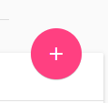
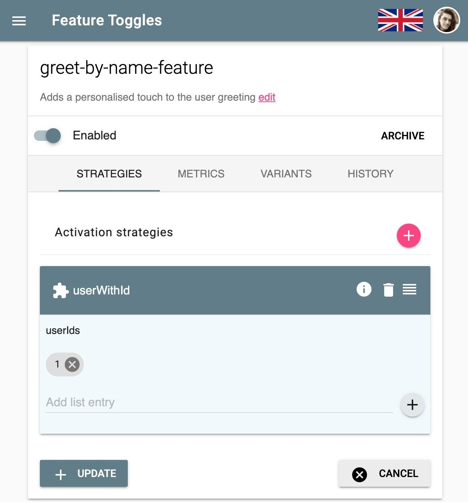

<h1 class="title">Gettings started with Feature Flags and Progressive Delivery</h1>
<h2 class="subtitle">An introduction with examples using Unleash</h2>
<span class="date">2020-01-10</span>

In it's simplest form. A feature flag is an if statement. Lets take the example of an endpoint that returns the string `"Hello World"` when the user browses to [/greeting](http://locahost:8000/greeting):

```ts
app.get('/greeting', (req, res) => {
    res.send('Hello Hello')
})
```

Now lets suppose that we deploy this useful functionality to production, but after a few weeks, we get the idea that maybe we want to change it to greet the user directly by including their name from the database. Now, we could simply change this functionality and deploy a new version:

```ts
app.get('/greeting', (req, res) => {
    let user = getUserDetails(req)
    res.send(`Hello ${user.name}`)
})
```

However this version will roll out to everyone at the same time and if anything goes wrong, for example there may be a bug in `getUserDetails()`, we would then have to roll back our entire release. This may seem minor given this simple example, but in the real world we may be releasing multiple features in a single release and the rollback will affect all of those changes too, this happens because we now have a feature *Rollout* that is tightly coupled with the *Deployment*.

What we want to do is decouple Rollout and deployment. A better way would be for us to perform a check on a configurable variable so that we could choose to switch between features and allow us to roll back simply by changing the value of the configuration for that feature:

```ts
app.get('/greeting', (req, res) => {
    if (config.getBool('greet-by-name-feature')) {
        let user = getUserDetails(req)
        return res.send(`Hello ${user.name}`)
    }
    res.send('Hello World')
})
```

And that, is what I meant when I said that a feature flag in it's simplest form is an if statement. Its simply a check to see if the new code should be executed, and if it isn't then the old code runs as normal.

## Managing flags

The feature flag we implemented here allows us to roll out and roll back without redeploying our application, but there are risks. Depending on how our `config.getBool()` funciton works, we may need to restart the application to cause the value to change, or the value may live inside a config file that we would have to remote into the production server to change, which in a microservices architecture could be near impossible to get right.

Ideally we would want to have a centralised  management system for these flags so that we can respond more rapidly if we need to roll back a feature. While there isn't necessarily anything wrong with rolling your own feature flag system, it is a domain on it's own that requires many considerations and can cost you valuable time... and even money. 

One particular example is from a comp... well former company called Knight Capital, who's [reuse of a feature flag](https://dougseven.com/2014/04/17/knightmare-a-devops-cautionary-tale) caused an 8 year old bit of code to run unexpectedly; ultimately ending in the company's demise.

If you need any more convincing about using a proper flag management system, check out: [Feature Toggles: The Good, The Bad, and The Ugly with Andy Davies](https://youtu.be/r7VI5x2XKXw).

> I highly recommend watching this talk as it points out the serious potential pitfalls that come with using feature flags

## Choosing a feature flag system

There are several very viable options when it comes to feature flag management systems, but two of them really stand out to me:

- LaunchDarkly
- Unleash

*LaunchDarkly* is a very full featured [SAAS](https://en.wikipedia.org/wiki/Software_as_a_service) solution, and also caters for A/B testing and experimentation. One of my favourite features which I discovered while using it was that it will actually mark a flag as no longer used, which serves as a great notification that it's time to clean up that check in your code. LaunchDarkly is however a paid for product and may be overkill for a lot of projects that have much more basic needs.

*Unleash* is a much more lightweight, open source self-hosted solution that also has a (less prohibitively expensive for a normal human being) SAAS component called [Unleash Hosted](https://www.unleash-hosted.com). To me it's biggest benifit is the fact that I can package an instance for development by simply adding it to a `docker-compose.yml` file in the respective project, and it's for this reason I chose I will be using it in the code examples in the rest of this post.

## Using Unleash

You can choose to either use Unleash as a cloud service or run your own instance. 
To run unleash in your project. Simply add the following to your docker-compose.yml

```yaml
version: '3'
services:
  unleash:
    image: unleashorg/unleash-server:3.1
    ports:
      - "4242:4242"
    environment:
      DATABASE_URL: postgres://postgres:unleash@db/postgres
    depends_on:
      - db
  db:
    expose:
      - "5432"
    image: postgres:10-alpine
```

After running the command `docker-compose up` you will now have access to an Unleash interface at [http://localhost:4242/](http://localhost:4242/).

Let's take our earlier greeting example and convert it to use unleash. 

> Please note that while the code portions are a Node.JS example written in TypeScript, unleash supports multiple languages, If you need exact code, refer to [Unleash's documentation](https://unleash.github.io/docs/client_sdk) for the respective library.

Click the add button:



We can then create the flag in unleash with the same name *'greet-by-name-feature'*, for now, use the default activation strategy and click update.


In the code we will now have to import and initialise the unleash client library, pointing it at the correct url for our running Unleash instance.

```ts
import {initialize, isEnabled} from 'unleash-client'

const instance = initialize({
    url: 'http://localhost:4242/api',
    appName: 'node-unleash-example',
    instanceId: 'my-server-instance',
})
```

We then can simply replace our config check with the `isEnabled` function made available by the client library 

```ts
app.get('/greeting', (req, res) => {
    if (isEnabled('greet-by-name-feature')) {
        let user = getUserDetails(req)
        return res.send(`Hello ${user.name}`)
    }
    res.send('Hello World')
})
```

Now toggling between our old and new code is as simple as the flick of a switch. Here I ran this infinite loop in the shell to call the endpoint and then flicked the switch to change the value.

```sh
while true; do curl http://localhost:8000/greeting; echo ''; sleep 2; done
```
And got the following results.


As you can see the change isn't quite immediate, this is due to the fact that the unleash client is periodically updating the value so that not every call to your api will double the amount of traffic on your network. I have however seen it happen a lot faster than in this gif when I experimented with unleash in C#, as can be seen in this tweet:

<blockquote class="twitter-tweet"><p lang="en" dir="ltr">Playing with Unleash in dotnet, was a very simple setup. <a href="https://t.co/pZwJz9Lijz">pic.twitter.com/pZwJz9Lijz</a></p>&mdash; Divan Visagie (@DivanVisagie) <a href="https://twitter.com/DivanVisagie/status/1198301409298530306?ref_src=twsrc%5Etfw">November 23, 2019</a></blockquote> 
<script async src="https://platform.twitter.com/widgets.js" charset="utf-8"></script>


# Progressive delivery

As you have seen so far, feature flags on their own can be valuable because they decouple rollout from deployment, we can easily switch between our old and new code simply by changing a value in our configuration. However, there is still risk, switching on a feature switches it on for everybody and that means breaking changes will affect all the users of our application.

What if instead we were to roll out changes to a small subset of users first? That way we could reduce the impact of a breaking change, or even target only live test users. This concept is called [Progressive Delivery](https://searchitoperations.techtarget.com/definition/progressive-delivery).


Unleash allows progressive delivery by letting you add a context to your `isEnabled` call and lets you use different activation strategies that will return a different value depending on the properties you provided in the context.

As an example I am going to delete the default activation strategy for our greeting feature and replace it with a `userWithId` strategy and add the UserId 1 to the list of allowed Ids. This will mean that our new feature will only be turned on for a user with the ID of 1.



Up until now I haven't really revealed the `getUserDetails()` function, since it was really just a stub that returned a fake name for example purposes, so far our API had no need for any real user code to get it's job done, now however we will use this function to also provide the unleash context. We will implement users simply by adding a 'UserId' header to our request, that way we can easily test if our rollout strategy works by passing in a header in our curl request eg: `curl localhost:8000/greeting -H "UserId: 2"`

```ts
function getUserDetails(req: Request) {
    const userId  = req.header('UserId')
    console.log(req.headers)

    const unleashContext = {
        userId
    }

    return {
       name: 'FakeUser',
       unleashContext
    } 
}
```

Next let's change our greeting endpoint, the getUserDetails call will have to move to the top of the handler function since we now need to get the context for the `isEnabled()` call, we then simply pass in the context as a second paramater to said function:
```ts
app.get('/greeting', (req, res) => {
    const user = getUserDetails(req)
    if (isEnabled('greet-by-name-feature', user.unleashContext)) {
        return res.send(`Hello ${user.name}`)
    }
    res.send('Hello World')
})
```
Now, calling the endpoint with a UserId of 1 should result in the new feature being displayed, while any other user will still be running the good old *Hello World* greeting.


And it was successful! We rolled out exclusively to user 1 without affecting anyone else, we are also able to see metrics on how many requests an hour are served our new feature vs the old feature, this can come in handy when it's time to decide to remove the flags from your code.

When you do this make sure to archive the flag in unleash, which will then never again let you create a flag with the same name, preventing any potential checking code you left behind from being unintentionally reactivated.

Unleash has many other activation strategies when it comes to Progressive Delivery and should serve most use cases, we have only really scratched the surface here. However if you have more complex needs It might be a sign that you are looking for something with a more advanced feature set like LaunchDarkly, which allows very find grained control over users and user segments.

