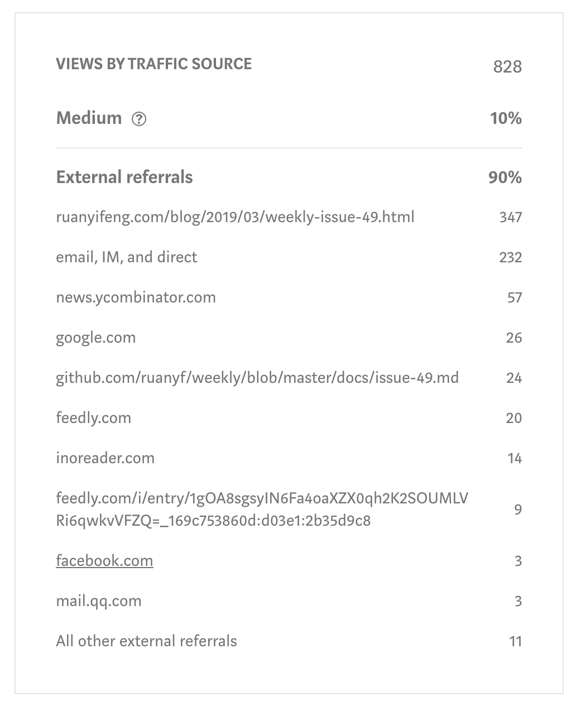

<h1 class="title">Moving from Medium</h1>
<h2 class="subtitle">Does it make sense?</h2>
<span class="date">2019-06-03</span>

> **Update:**
> While this site is still clearly no longer medium based, I have moved on from Hugo and have instead gone for my own implementation of a Markdown -> HTML converter

For a few years now my blog has primarily been on the [Medium](medium.com) platform, and for good reason. The platform provided a clean interface with a nice easy to use editor and supports cool things like notes, highlights and allowing editors to give their two cents on an unpublished article. The main draw however is that it's a popular platform and the theory is that it would draw more views by simply being on medium or having better SEO or whatever. I have very little knowledge of SEO in fact, that's kind of the point. I wouldn't need to, it would all be handled for me. Right?

Now if you hang around [Hackernews](news.ycombinator.com) you may have seen quite a few angry people moving off the platform due to the interface starting to become, eh... not so clean and paywalls popping up. Now I don't have anything in particular against a business tying to have an actual business model, but I was dissapointed at the banner that now took up valuable vertical screen real-estate for users who are not logged in and other things becoming cluttered. That in itself isn't really good enough reason to leave though, there is also the ease of use, the fact that I don't have to maintain my own site, and the all that traffic related stuff... or is it?

# Reconsidering the benefits

Even if the reason people were leaving Medium fairly loudly was different to my needs, it did drive me to rethink things. Was it giving me the benefits I thought? Is it meeting my needs in terms of workflow, or how rapidly I could blog? And finally, how much of the traffic was because I was on Medium?

## Workflow

The workflow is a bit tedious, given the content I produce. I have a lot of code snippets and on Medium that means either using a screenshot image, having no syntax highlighting or using [GitHub](https://github.com) gists. I usually settle for gists since it renders the best, but that's a lot of work managing multiple gists per article, it would be great to just have markdown and paste the code right there and have it neatly highlighted.

```go
fmt.Print("Where is my MARKDOWN??")
```

Markdown would certainly help when it came to actually typing out the content, and this would also mean all the content would live in the same place and have version control, something that could prove useful for technical articles that may require a content update once in a while. Markdown can also form as a raw "Source" if you will, not being locked to a platform yet being simple and editable.

## Traffic

The other argument I had was traffic. Surely medium was driving traffic to my posts?

So I took a look at my [most popular](https://divanv.com/post/building-a-desktop-ui-in-go/) post and found that only 10% of the traffic comes from inside Medium itself, the rest comes from either Google searches, places I posted links, or direct shares when people found the content useful.



To me 10% is a worthy sacrifice for feeling more at home in markdown and possibly producing more content and thus making up for lost views. Plus the point of me counting views isn't because I want some sort of benefit but rather because I live in the hopes that my content is useful and therefore I want it to be visible... and searchable.

Searchablity is a large driver of traffic for this kind of content and that brings me to the part I don't know. Will my traffic suffer if I host my own content? As I mentioned I know nothing SEO.

> 
> You know nothing SEO

And that brings me to this very site you are reading this on, it's an experiment to see if the traffic I get is affected, and whether or not I am even worried if there is a change. I have ported over my most popular Medium article to see if it will eventually catch up when it comes to search driven traffic and also intend to import stuff from platforms I have long ago let go stale.

This my own static content hosted by GitLab and using [Hugo](https://gohugo.io/). For me the tool is simple to use and it was very easy to set up comments and analytics and best of all, my posts are in markdown. I personally feel like I have better control of my workflow now, but time will tell if this works out, I still think it's worth jumping in and seeing if it all works out.
