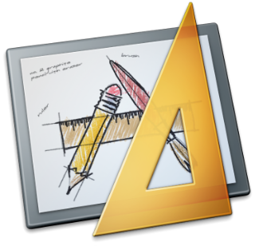

<h1 class="title">Nibs or Storyboards?</h1>
<h2 class="subtitle"></h2>
2012-08-17

I started iOS development after the release of iOS5 and only learned and developed using the new features such as ARC and Storyboards. Now storyboarding is a great concept that allowed you to create an app ,even with multiple views without even typing a single line of code.

Storyboarding worked well for a while and has many benefits, but then I realised a problem. When you want to access a control that was previously segued to from one or more other controls ,you start to create a very horrible looking,difficult to manage spiders-web of a mess which just gets worse as your application becomes more complex.
So the solution is to use nibs right? Well not exactly ,you see, I like some of the features in the storyboard ,and I still want to use them for general navigation, and you are allowed to use both in the same application. So heres my idea of a rough set of rules to follow when deciding if a control should be in the storyboard or as a separate nib and called programmatically
- If it's used more than once ,make it a nib
- If you are going to use a view in its exact state(meaning you don't change a single thing in the view editor from one call to another), more than once, put it in a nib. This will save you from having to re-create/copy or spider-web the view. Just a few simple lines and its there. Plus this will make your control more abstract and easier to use in other projects.
- If it's used more than once ,with a different view,but same viewController,fork it(storyboard)
- What I describe as forking is creating/copying and modifying the view for use with the same viewController for a slightly different purpose.You don't want more than one or two(iPad and iPhone) nibs,so if a view needs to be forked ,rather do it in the storyboard.Also ,in this scenario ,if you need to access one of those forked views more than once ,you can programatically create storyboard segues to eliminate the spider web effect.
- If you don't need to feed it data, use the storyboard.
- If all you need is a simple segue without passing any data from one ViewController to another , just do a click and drag segue,no need to overcomplicate things.
- Popovers should usually be nibs
- Popovers(iPad only) are usually called from events such as button presses, so its nice to be able to call them programatically. Also In my experience , adding more than one popover segue to a view in the storyboard deletes the other segue(may cause swearing). 
- Change the rules
- Don't always follow the rules , sometimes ,in a particular context, rules need to be changed so do whatever makes the app easier to maintain or more effective.

---

*Originally posted on [Blogspot](https://divcode.blogspot.com/2012/08/nibs-or-storyboards.html)*
