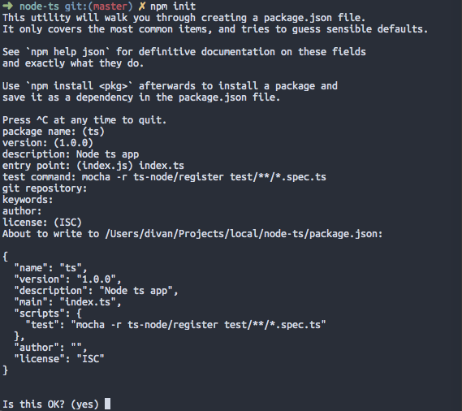
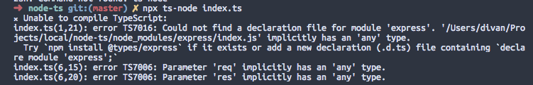

<h1 class="title">Node.js with TypeScript</h1>
<h2 class="subtitle">Setting up a Node.js app with TypeScript, Nodemon, and Mocha/Chai tests</h2>
<span class="date">2019-01-02</span>


>
The idea with this article is to simply provide a quick tutorial on how to set up a simple [Node.js](https://nodejs.org/) project with nodemon for development reloading and of course unit tests. This means I have gone for a minimalist approach and tried to keep everything as generic as possible by not doing things like sticking to my preference of [Yarn](https://yarnpkg.com/en/) or adding unnecessary dependencies.


Let’s start off the same way we start any node project, running [npm](https://www.npmjs.com/) init in our project’s folder.


```bash
npm init
```

When prompted by npm to answer the questions you have the option of just pressing enter every time and filling out your package.json later, but I took this opportunity to sneak in our test command:


```bash
mocha -r ts-node/register test/**/*.spec.ts
```

Here we get a glimpse of the tool that is helping us achieve this whole thing; [ts-node](https://github.com/TypeStrong/ts-node) provides TypeScript execution for Node.js, and here it allows us to execute mocha tests that were written in TypeScript.

You will also notice that I set our main option to *index.ts* instead of *index.js*, later on this will tell tools like nodemon where to look for our starting point.




Next we need to set up TypeScript in the project

```bash
npm i typescript
```

While we are here, let’s also install ts-node:

```bash
npm i -D ts-node
```

You have the option of also installing TypeScript globally but I chose to run the locally installed module for the next step using [npx](https://www.npmjs.com/package/npx).

So, lets initialise our TypeScript project.
```bash
npx tsc --init
```
We should now have our default *tsconfig.json* file


# Something to execute

In this next bit we need to write some TypeScript to execute. I have gone for a simple express app here in *index.ts*:

```ts
import express, {Express} from 'express'

const port: number = 3000
const app: Express = express()

app.get('/', (req, res) => {
    res.json({message: 'Hello World'})
})

app.listen(port, () => {
    console.log(`Express is listening on port ${port}`)
}
```


At this point if we run the app having only installed the express module (`npm i express` ):

```bash
npx ts-node index.ts
```

We will get the following error:



This is because the default *tsconfig.json* has strict type checking enabled, removing `“strict”: true` would indeed fix this error, but since you are going through the effort of setting up TypeScript, you probably really want type safety. So the other option is to install the types for any packages you may need, in this example, for express:

```bash
npm i @types/express
```
Now when we run `npx ts-node index.ts` we should get a running express server:


We don’t however want to be running our app via ts-node in production, so let’s set up a start script that will build our JavaScript and run our app in the regular Node.js environment.

Currently if we had to run `tsc` it would output our *index.js* right next to our source code. Some people prefer it this way and that’s completely fine, but my personal preference is to have output go to a build directory, we can do this by setting the outDir property in our *tsconfig.json*:


```json
{
...
    "outDir": "./build",
...
}
```

We can now set up our `build` and `start` scripts in our *package.json:*

```json
{
...
    "scripts": {
        "build": "tsc",
        "start": "tsc && node ./build/index.js",
        "test": "mocha -r ts-node/register test/**/*.spec.ts"
    },
...
}
```

# Unit Testing

Now that we have a running TypeScript app, we want to set up some unit testing. Since we already set up mocha with ts-node in the beginning we should be able to simply run it once written, you don’t have to just use mocha though, ts-node also [officially](https://github.com/TypeStrong/ts-node#tape) supports [tape](https://github.com/substack/tape), and you can probably get it to run other tests as well.

Lets start off by installing our dependencies, remembering to also install the typings for mocha and chai:
```bash
npm i -D mocha chai @types/mocha @types/chai
```
Then we create a simple test (I called mine *default.spec.ts*) inside a folder named *test*:

```javascript
import {expect} from 'chai'

describe('When we run tests', () => {
    it('Should actually work' , () => {
        expect(true).to.be.eq(true)
    })
}
```

This certainly isn’t a useful test but this isn’t a unit testing tutorial, we just want to see that test’s run in our setup. Let’s run `npm test`:


Neat! our test’s work.

# Nodemon
[Nodemon](https://nodemon.io/) is a neat tool that will run and reload your application when the source code changes. Honestly once you work with a tool like this you want it everywhere because it comes in really handy during development.

First, lets install nodemon

```sh
npm i -D nodemon
```

Next we configure nodemon to work with our TypeScript files. Nodemon can be configured either as a property inside your *package.json* or in it’s own *nodemon.json* file, which is the method I chose to use here:

```json
{
    "ext": "ts",
    "exec": "npm start"
}
```

> 
**Pro Tip:** The nodemon config supports an env property so you can set environment variables, I use this to set environment variables for dev that will be different in production, ie:
`“env”: { “DEBUG”: “app,app:*” }`

Now if we simply run `npx nodemon` our app will restart when we make code changes, go add a line to your index.ts and watch the magic!

And that’s a wrap! You should now have a nicely set up TypeScript Node.js application. Enjoy the type safety!


