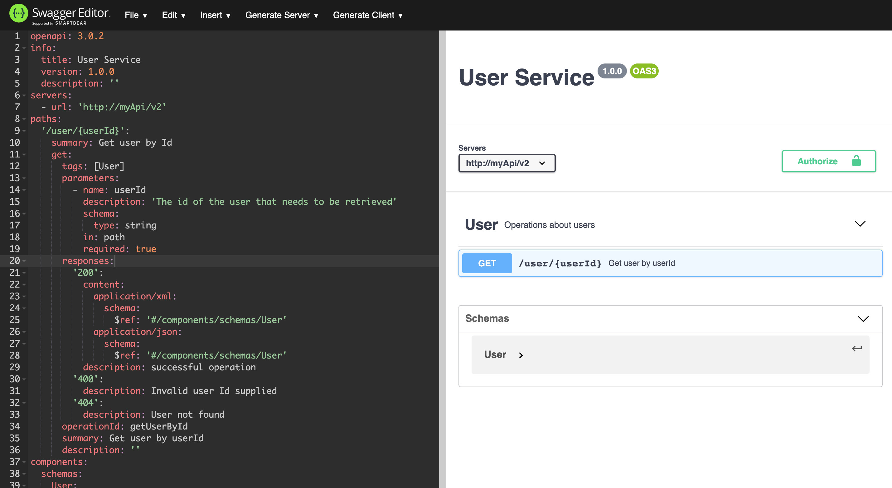

<h1 class="title">Documenting RESTful APIs</h1>
<h2 class="subtitle">An introduction to OpenAPI and Swagger</h2>
<span class="date">2020-06-22</span>

Let's say we are tasked with creating a RESTful API that will return a user object based on the user Id, e.g. `http://myApi/user/123` will return the user with the ID 123.

```js
{
  id: 123,
  username: 'realFakeDoors',
  displayName: 'Real Fake Doors',
  email: 'getreal@fakedoors.com',
  accountStatus: 'verified'
}
```

This endpoint is to be consumed by other developers in our company as part of a micro-services architecture. We cannot simply leave this endpoint undocumented, since this would require anyone consuming our service to have to open up and read our code in order to understand if our service is even what they were looking for.

So, we need to document which endpoints we have and what sort of objects they return. However we need to do it in a way that is easy to read for a developer, even if they are using a completely different language to consume our API.

Furthermore, our documentation style may be different from the documentation styles of other services in our company. So at the very least we will have to define a standard that can be used across all of our services.

Defining a standard without looking for an existing one first though can lead to issues.


> [https://xkcd.com/927/](https://xkcd.com/927/)

This is where the [Open API Specification](https://swagger.io/specification/) comes in.

> The OpenAPI Specification (OAS) defines a standard, language-agnostic interface to RESTful APIs which allows both humans and computers to discover and understand the capabilities of the service without access to source code, documentation, or through network traffic inspection.

# Defining a document

So basically, OpenAPI is a standardised way of defining an API in either a JSON or YAML format. Lets see what a very simple definition of our user API would look like following the OpenAPI standard .

```yaml
openapi: 3.0.2
info:
  title: User Service
  version: 1.0.0
  description: ''
  termsOfService: 'http://swagger.io/terms/'
  contact:
    email: apiteam@swagger.io
  license:
    name: Apache 2.0
    url: 'http://www.apache.org/licenses/LICENSE-2.0.html'
servers:
  - url: 'http://myApi/v2'
paths:
  '/user/{userId}':
    summary: Get user by Id
    get:
      tags: []
      parameters:
        - name: userId
          description: 'The id of the user that needs to be retrieved'
          schema:
            type: string
          in: path
          required: true
      responses:
        '200':
          content:
            application/xml:
              schema:
                $ref: '#/components/schemas/User'
            application/json:
              schema:
                $ref: '#/components/schemas/User'
          description: successful operation
          x-last-modified: 1592503145775
        '400':
          description: Invalid user Id supplied
        '404':
          description: User not found
      operationId: getUserById
      summary: Get user by userId
      description: ''
    x-last-modified: 1592502781135
components:
  schemas:
    User:
      type: object
      properties:
        id:
          format: int64
          type: integer
        username:
          type: string
        displayName:
          type: string
        email:
          type: string
        accountStatus:
          type: string
      xml:
        name: User
      example: ''
      x-last-modified: 1592502967853
  securitySchemes: {}
  responses: {}
  parameters: {}
tags:
  - name: Get User By Id
    description: Operations about users
externalDocs:
  description: Find out more about Swagger
  url: 'http://swagger.io'
security: []
```

Now you may be thinking to yourself: "You said easier to read", and this document at first glance admittedly looks a little complicated. But while this may not be the best format for humans to read, since OpenAPI is a standard, it makes it very easy for programs to read. As a result there exists a large selection of tools that allow you to visualise these documents, one such tool is the [Swagger Editor](https://editor.swagger.io/).



> Our user endpoint displayed in the swagger editor

OpenAPI documents can also be imported directly into Postman as a collection.


> Our user endpoint document imported as a postman collection

Furthermore, Swagger provides a tool called [Swagger UI](https://swagger.io/tools/swagger-ui/), which you would have seen a hint of in the Swagger Editor. This is a simple web based UI that you can set up to display and even try out examples from your OpenAPI specification. You can choose to display this anywhere you could display a website, be it on your company intranet, developer facing website if your API is public facing, or my personal favourite, package it as the root endpoint of the API itself.

Below is an example of a personal project of mine in which I have packaged Swagger UI as part of the service. This way if the developer has the API running on their machine, they already have access to the documentation, even without an internet connection.


You will notice that here you can actually expand this endpoint and make calls to the API using the Swagger UI, and since it is packaged with the service, we don't have to even configure the base URL, it's all in context.


Schemas representing the Objects that are either sent to or returned from the API are also displayed in the Swagger UI.


# Generating Documentation

So, we have addressed the readability concerns one might have with an OpenAPI specification document, however even our small single endpoint is a fairly long document to write by hand.

This is where Auto-Generated OpenAPI documentation comes in, and since OpenAPI is so popular, there is a library for generating OpenAPI/Swagger docs for most of the popular programming languages.

Now you may have noticed that I said OpenAPI/Swagger and not just OpenAPI. This is because Swagger came into being before OpenAPI, so many related libraries still use the Swagger brand name, but most new versions of Swagger libraries are expected to be OpenAPI compatible.

Now for some languages, setting up auto generated OpenAPI documentation requires a little less work than others, since they can leverage static typing for information about schemas and routing. For example while you can set up basic auto generation for C# or Java without adding any additional documentation to the endpoints, you will most certainly have to write some JSDoc comments if you want the same thing in NodeJS.

## Java Example

Lets take our user endpoint from earlier as an example. Here I will implement the user endpoint in Java using Spring Boot.

After creating a simple [Spring Boot](https://spring.io/projects/spring-boot) project with [Spring Initializr](https://start.spring.io/), very little code needs to be added in order to to get a working mock endpoint.

We simply need to add the following controller `UserController.java`

```java
@RestController
@RequestMapping("/user")
public class UserController {

	@GetMapping("/{id}")
	public ResponseEntity<User> getUser(@PathVariable("id") String id) {
		User response = new User()
						.setId(123)
						.setUsername("fake")
						.setDisplayName("Fake User")
						.setAccountStatus("Activated")
						.setEmail("fakeemail@test.com");

		return new ResponseEntity<>(response, HttpStatus.OK);
	}
}
```

And here the Entity of type `User` which it returns in `User.java`

```java
public class User {
    private Integer id;
    private String username;
    private String displayName;
    private String email;
    private String accountStatus;

    ...
    //Getters and Setters defined offscreen
}
```

This is now enough that when I run it and browse to [http://localhost:8080/user/123](http://localhost:8080/user/123) I see the following:

```json
{
  "id": 123,
  "username": "fake",
  "displayName": "Fake User",
  "email": "fakeEmail@test.com",
  "accountStatus": "Activated"
}
```

Now that the working endpoint is in place, I can add OpenAPI documentation with minimal effort. I simply need to import the `springdoc-openapi-ui` library.

```groovy
implementation 'org.springdoc:springdoc-openapi-ui:1.3.1'
```

Inject an instance of the OpenAPI object to tell the generator what to call itself.

```java
@Bean
public OpenAPI customOpenAPI() {
	return new OpenAPI()
		.info(new Info().title("User Service").version("v1").description("Service for user management")
		.termsOfService("http://swagger.io/terms/")
		.license(new License().name("Apache 2.0").url("http://springdoc.org")));
}
```

And simply add configuration to `application.properties` in order to set swagger-ui to our root path.

```bash
springdoc.swagger-ui.path=/
springdoc.swagger-ui.version=v
```

Browsing to [http://localhost:8080/v3/api-docs](http://localhost:8080/v3/api-docs) now returns the following OpenAPI specification document:

```json
{
  "openapi": "3.0.1",
  "info": {
    "title": "User Service",
    "description": "Service for user management",
    "termsOfService": "http://swagger.io/terms/",
    "license": {
      "name": "Apache 2.0",
      "url": "http://springdoc.org"
    },
    "version": "v1"
  },
  "servers": [
    {
      "url": "http://localhost:8080",
      "description": "Generated server url"
    }
  ],
  "paths": {
    "/user/{id}": {
      "get": {
        "tags": ["user-controller"],
        "operationId": "getUser",
        "parameters": [
          {
            "name": "id",
            "in": "path",
            "required": true,
            "schema": {
              "type": "string"
            }
          }
        ],
        "responses": {
          "200": {
            "description": "default response",
            "content": {
              "*/*": {
                "schema": {
                  "$ref": "#/components/schemas/User"
                }
              }
            }
          }
        }
      }
    }
  },
  "components": {
    "schemas": {
      "User": {
        "type": "object",
        "properties": {
          "id": {
            "type": "integer",
            "format": "int32"
          },
          "username": {
            "type": "string"
          },
          "displayName": {
            "type": "string"
          },
          "email": {
            "type": "string"
          },
          "accountStatus": {
            "type": "string"
          }
        }
      }
    }
  }
}
```

And browsing to our root path [http://localhost:8080/](http://localhost:8080/swagger-ui/index.html?configUrl=/v3/api-docs/swagger-config) reveals the Swagger UI.


# Summary

We have learned that OpenAPI is a standardised, machine readable document format designed for documenting RESTFul APIs. OpenAPI documents can be read by a multitude of different UI tools to make reading and testing these APIs easier.

It's also very simple to add documentation that can be generated using Swagger libraries. Hopefully you now see the value in documenting your APIs and that just a little work can assist both you and your API consumers in being way more productive.

For concrete examples see:

- [Node.js/Express](https://divanv.com/post/express-openapi/)
