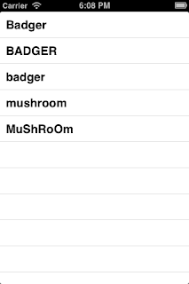
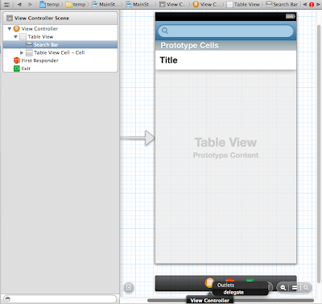

<h1 class="title">Searching through a UITableView</h1>
<h2 class="subtitle">An Objective-C tutorial</h2>
<span class="date">2012-11-02</span>


## Prerequisites

This tutorial assumes you already know whats going on when it comes to creating a project and populating a UITableViewController's table with some data.

A lot of the time you can end up with a very long list of items in a UITableView and you really need a search bar to filter what you want. This is when a UISearchBar is needed in your table, in this tutorial , I will explain how to link up that UISearchBar and use it to filter through your tableView.

Lets get started by setting up a project and populating a standard UITableViewController:


### ViewController.h
```objectivec
#import <UIKit/UIKit.h>
@interface ViewController : UITableViewController 
@end
```

### ViewController.m
```objectivec
#import "ViewController.h"
@interface ViewController (){
@private
    NSArray *objects;
}
@end
@implementation ViewController
- (void)viewDidLoad
{
    [super viewDidLoad];
    // Do any additional setup after loading the view, typically from a nib.
    
    objects = @[@"Badger",@"BADGER",@"badger",@"mushroom",@"MuShRoOm"];
    [self.tableView reloadData];
}
- (void)didReceiveMemoryWarning
{
    [super didReceiveMemoryWarning];
    // Dispose of any resources that can be recreated.
}
#pragma mark - TableView DataSource -
- (NSInteger)numberOfSectionsInTableView:(UITableView *)tableView{
    return 1;
}
-(NSInteger)tableView:(UITableView *)tableView numberOfRowsInSection:(NSInteger)section{
    
    return objects.count;
}
-(UITableViewCell*)tableView:(UITableView *)tableView cellForRowAtIndexPath:(NSIndexPath *)indexPath{
    
    UITableViewCell *cell = [tableView dequeueReusableCellWithIdentifier:@"Cell" forIndexPath:indexPath];
    
    cell.textLabel.text = objects[indexPath.row];
    
    return cell;
}
@end
```



Now that we have that running lets drop a search bar on to that table in the storyboard.


The next step is so easy to miss and can cause tons of headaches if it isn't done, set the ViewController  as the UISearchBar's delegate by ctrl+dragging:


> If you dont do this , you may end up scratching your head for hours.

If you were to run the application now you would notice that you get a search button on your keyboard once you start typing text into the search bar. As you would think , the search can be activated from this   button,but it can also be activated on text change. In this tutorial we will cover both , however when writing an application you should decide wich one to use as using both is a little impractical. 

Personally in the real world, I use the "on text change" for searching locally and the "on search button press" for searching over the web when connected to a web service.

modify 
### ViewController.h:

```objectivec
#import <UIKit/UIKit.h>
@interface ViewController : UITableViewController <UISearchBarDelegate>
@end
and now in ViewController.m we will handle the messages that the search bar will send its delegate:

#pragma mark - SearchBar Delegate -
-(void)searchBar:(UISearchBar *)searchBar textDidChange:(NSString *)searchText{
    NSLog(@"searchBar text changed to : %@",searchText);
}
- (void)searchBarSearchButtonClicked:(UISearchBar *)searchBar{
    NSLog(@"searchBar button clicked");
}
```

Now lets put in some search code ,first we need to create a place to store the searched data and a BOOL ivar to determine which array the tableView must use ,after this we also need to tell the tableView which data sources to use by modifying the DataSource methods:

```objectivec
@interface ViewController () {
@private
    NSArray *objects;
    NSArray *searchedData;
    BOOL isFiltered;
}
```

and then:

```objectivec
-(NSInteger)numberOfSectionsInTableView:(UITableView *)tableView{
    return 1;
}
-(NSInteger)tableView:(UITableView *)tableView numberOfRowsInSection:(NSInteger)section{
    
    return isFiltered ? searchedData.count : objects.count;
}
-(UITableViewCell*)tableView:(UITableView *)tableView cellForRowAtIndexPath:(NSIndexPath *)indexPath{
    
    UITableViewCell *cell = [tableView dequeueReusableCellWithIdentifier:@"Cell" forIndexPath:indexPath];
    
    cell.textLabel.text = isFiltered ? searchedData[indexPath.row] : objects[indexPath.row];
    
    return cell;
}
```

Now let do some search code:

```objectivec
#pragma mark - SearchBar Delegate -
-(void)searchBar:(UISearchBar *)searchBar textDidChange:(NSString *)searchText{
    
    if (searchText.length == 0)
        isFiltered = NO;
    else
        isFiltered = YES;
    
    NSMutableArray *tmpSearched = [[NSMutableArray alloc] init];
    
    for (NSString *string in objects) {
        
        //we are going for case insensitive search here
        NSRange range = [string rangeOfString:searchText
                                      options:NSCaseInsensitiveSearch];
        
        if (range.location != NSNotFound)
            [tmpSearched addObject:string];
    }
    
    searchedData = tmpSearched.copy;
    
    [self.tableView reloadData];
}
- (void)searchBarSearchButtonClicked:(UISearchBar *)searchBar{
    NSLog(@"searchBar button clicked");
}
```

The code for searchBarSearchButtonClicked will be the same as what i have implemented in textDidChange so I wont repeat it here.

Lets go ahead now and run the app:


> Only Mushrooms

As you can see, the case insensitive search works , now as usual , the full code below

## Full code

### ViewController.h

```objectivec 
#import <UIKit/UIKit.h>
@interface ViewController : UITableViewController <UISearchBarDelegate>
@end
```
### ViewController.m
```objectivec
@interface ViewController (){
@private
    NSArray *objects;
    NSArray *searchedData;
    BOOL isFiltered;
}
@end
@implementation ViewController
- (void)viewDidLoad
{
    [super viewDidLoad];
// Do any additional setup after loading the view, typically from a nib.
    
    objects = @[@"Badger",@"BADGER",@"badger",@"mushroom",@"MuShRoOm"];
    [self.tableView reloadData];
}
- (void)didReceiveMemoryWarning
{
    [super didReceiveMemoryWarning];
    // Dispose of any resources that can be recreated.
}
#pragma mark - TableView DataSource -
- (NSInteger)numberOfSectionsInTableView:(UITableView *)tableView{
    return 1;
}
-(NSInteger)tableView:(UITableView *)tableView numberOfRowsInSection:(NSInteger)section{
    
    return isFiltered ? searchedData.count : objects.count;
}
-(UITableViewCell*)tableView:(UITableView *)tableView cellForRowAtIndexPath:(NSIndexPath *)indexPath{
    
    UITableViewCell *cell = [tableView dequeueReusableCellWithIdentifier:@"Cell" forIndexPath:indexPath];
    
    cell.textLabel.text = isFiltered ? searchedData[indexPath.row] : objects[indexPath.row];
    
    return cell;
}
#pragma mark - SearchBar Delegate -
-(void)searchBar:(UISearchBar *)searchBar textDidChange:(NSString *)searchText{
    
    if (searchText.length == 0)
        isFiltered = NO;
    else
        isFiltered = YES;
    
    NSMutableArray *tmpSearched = [[NSMutableArray alloc] init];
    
    for (NSString *string in objects) {
        
        //we are going for case insensitive search here
        NSRange range = [string rangeOfString:searchText
                                      options:NSCaseInsensitiveSearch];
        
        if (range.location != NSNotFound)
            [tmpSearched addObject:string];
    }
    
    searchedData = tmpSearched.copy;
    
    [self.tableView reloadData];
}
- (void)searchBarSearchButtonClicked:(UISearchBar *)searchBar{
    NSLog(@"searchBar button clicked");
}
@end
```