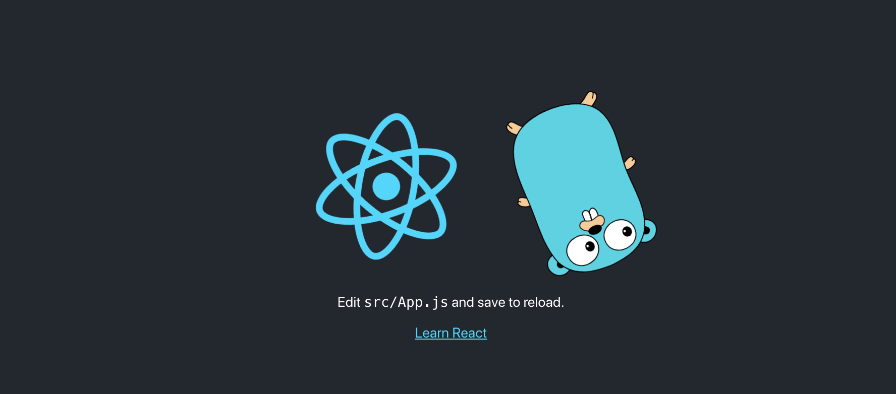
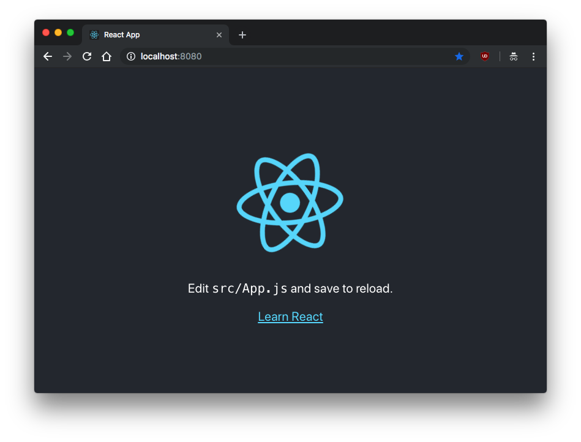
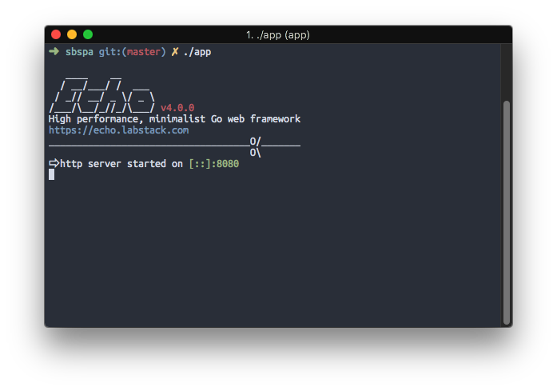
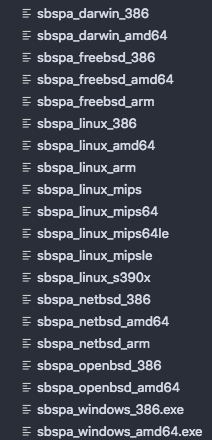

<h1 class="title">A single binary SPA using Go</h1>
<h2 class="subtitle">Using statik and echo with to serve up a single binary React app</h2>
<span class="date">2019-02-24</span>



I think one of the most elegant things that Go does is output a single portable binary. So when building a full web application, it would be nice to keep the output just as simple.

Luckily, I wasn’t alone in this thought, and a neat little tool called [statik](https://github.com/rakyll/statik) exists to do just that.

The library itself supplies sufficient documentation to get it working just for simply serving the application via Go’s http library, but, using it in a practical sense probably means that you want to use a framework like echo for things like endpoints and websockets. Here I will cover getting statik to serve files using the [echo](https://echo.labstack.com/) framework.

## Creating the React App

In this project I decided to follow some [golang-standards](https://github.com/golang-standards/project-layout) and opt to put the react project in `./web`. This was fairly simple with [create-react-app](https://github.com/facebook/create-react-app):

```sh
create-react-app web
```
We are going to need to install dependencies and build our react app for serving, so let’s run the following in the `./web` directory

```sh
yarn
yarn build
```

`create-react-app` creates this app as a git repository, so in order to not have issues with the parent repository, we should delete the .git inside the web folder.

```sh
rm -rf .git
```

## Packaging the frontend

Before we forget, let’s get back to the root directory of our project.

The next step would be to package the frontend into a go file, this part is done by the `statik` tool, so, time to go get that (pun intended):

```sh
go get github.com/rakyll/statik
```

Now we could run the statik command to package the app, but there are some things that we are going to have to repeat every time some changes are made to the React app:

```sh
cd web && yarn && yarn build && cd ..
statik -src=./web/build
```

Repeating tasks should always be scripted, that’s your job as a software developer, so I think this is the perfect time to introduce a Makefile.

```makefile
.ONESHELL:
.PHONY: statik

statik:
	cd web && yarn build
	statik -src=./web/build

clean:
	rm -rf ./statik
```

Now running `make statik` will build our react app and then generate our statik Go file, this will become increasingly useful as we update our app.

## Serving the frontend

Now that we have our packaged frontend, we need to serve it. Let’s create a main.go file:

```go
package main

import (
	"net/http"

	_ "github.com/divanvisagie/sbspa/statik"
	"github.com/labstack/echo"
	"github.com/rakyll/statik/fs"
)

func main() {
	e := echo.New()
	addr := ":8080"

	statikFS, err := fs.New()
	if err != nil {
		e.Logger.Fatal(err)
	}

	h := http.FileServer(statikFS)

	e.GET("/*", echo.WrapHandler(http.StripPrefix("/", h)))

	e.Logger.Fatal(e.Start(addr))
}
```

There are some important things to note here.

In the imports you will see we are importing our packaged app with its fully qualified path:

```go
_ "github.com/divanvisagie/sbspa/statik"
```

This is then used by `“github.com/rakyll/statik/fs”` for serving up the files simply by having the same package name.

The other is that for echo, we use the WrapHandler function since statik is designed for the built in HTTP library in Go and not special framework handlers. Luckily, echo is sane enough to provide us access to its underlying implementation.

```go
e.GET("/*", echo.WrapHandler(http.StripPrefix("/", h)))
```

After this line you could can build up a normal echo server with routes and even websockets to back your app. Something I have done successfully but will not cover here since I think the [documentation](https://echo.labstack.com/guide) of the library is quite sufficient.

Now, If we run

```sh
go run main.go
```
We should get the following result on http://localhost:8080 :



## Outputting the binary

Finally we want to output our binary so that we can send our React virus to friends, enemies, docker containers, and whomever else finds opening random executables to be a good idea.

```makefile
.ONESHELL:
.PHONY: statik all

all:
	$(MAKE) statik
	go build -o app ./main.go


statik:
	cd web && yarn build
	statik -src=./web/build

clean:
	rm -rf ./statik
```

Now simply running `make` will give us the binary: `app`.


## Conclusion

But Divan? This only allows me to run my React app on the OS I built it on, what if I want to run it on my x86 plan 9 machine?.
Fear not, this thing is written in Go, of course there is a tool for that. Enter [Gox](https://github.com/mitchellh/gox)!
Okay, that was a bit of a joke… sort of. I never really got plan 9 builds working, but I did get it to build for all of these architectures, and Gox does support plan 9:



I do however think that tools like Gox and [Goreleaser](https://github.com/goreleaser/goreleaser) demonstrate just why packaging an app like this is such a powerful concept. It opens up a lot of different strategies to deploy apps in the strangest ways on the strangest devices in a very simple format.