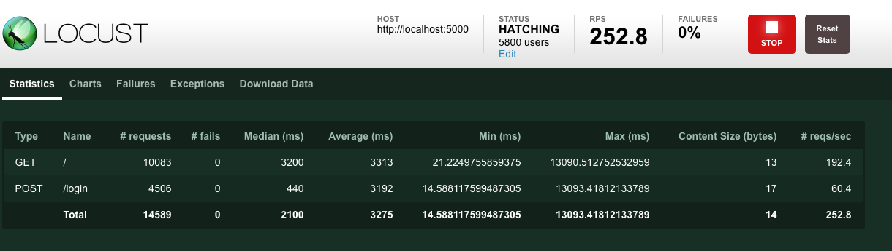

<h1 class="title">Swarm testing with Locust.io for the first time</h1>
<h2 class="subtitle">A beginners guide</h2>
<span class="date">2018-10-01</span>


When you build services for the web you want to make sure they don’t fall over completely when [too many users](http://www.whatisfailwhale.info/) hit your system all at one time. What you want, is to be able to simulate that load spike before it happens in production.

I have used [artillery.io](https://artillery.io/) in the past to get this done, and there are many other services that will test basic load, but I wanted to find a go-to tool that I could learn to rely on that felt like it was not too complicated and was more developer friendly than GUI based alternatives that simply record your traffic while browsing a website.

It’s not surprising then that when shopping around for a simple, easy to use code based tool that something written in Python [blips on the radar](https://www.thoughtworks.com/radar/tools/locust). Locust seemed to fit the profile of what I was looking for well, so I decided to hop right in and test it out.

The plan was to simply create a test app and then point Locust at it, nothing fancy, just all on my local machine. I like doing this when I try out a tool because it let’s me back out before too much investment yet gives me a sense of how it works and potential pain points.

## The Server

I decided that since I would be writing the tests in Python I would whip up a the test service in the same language. A microframework seemed like the perfect tool for that so it was [Flask](http://flask.pocoo.org/) to the rescue.

Locust simulates users hitting the site, so I decided on a simple flow of login and browse to index.

Below is my super secure server implementation using flask, a lightweight solution indeed! Though I wouldn’t want to roll anything like this into production any time soon.

```py
from flask import Flask, request, abort
app = Flask(__name__)
token = 'a-very-real-token'

@app.route('/login', methods = ['POST'])
def login():
    return token

@app.route('/')
def hello():
    token = request.headers.get('Authorization')
    if token != token:
        abort(401)
    print(f'Found token {token}')
    return 'Hello Locust!'
```

I ran a single instance to test against simply using the dev server: `FLASK_APP=server.py flask run`

## The Test
The next thing to do was to create a [locustfile](https://docs.locust.io/en/latest/writing-a-locustfile.html) to define the user behaviour that we would be testing. The [quick start guide](https://docs.locust.io/en/latest/quickstart.html) was a good place to start, but I make some modifications to store my super secure token.

```py
from locust import HttpLocust, TaskSet, task

def login(l):
    response = l.client.post('/login')
    token = response.content
    print(f'Got token from login: {token}')
    return token

class MyTaskSet(TaskSet):
    def on_start(self):
        self.token = login(self)

    @task
    def my_task(self):
        print(f'executing with token: {self.token}')
        headers = {
            'Authorization': self.token
        }
        self.client.get('/', headers = headers)

class MyLocust(HttpLocust):
    task_set = MyTaskSet
    min_wait = 5000
    max_wait = 1500
```

Once I got that right (it took more attempts than I would like to admit), it was a matter of running locust against my endpoint with: `locust --host=http://localhost:5000`

After that, browsing to http://localhost:8089 gave me the following interface where I could set up my simulation.


Once you get up and going the interface is quite simple, providing details on average and median request speeds, exceptions, failures, charts, and the option to download the stats you have gathered in CSV form.




For me personally, this is enough, in practise If I needed more data, I would want to be gathering it from the instrumentation in the actual service I am testing.

The next step is to test more than a simple server, like something running in a cluster, but I think the technology has proven itself here enough to see what it can do and how simple it is to set up, and for me also proves that being able to use a neat scripting language like Python can really help get your job done.
