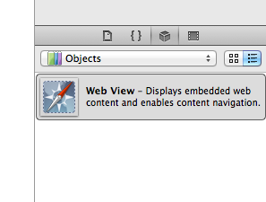

<h1 class="title">Adding a webkit view to your iOS application</h1>
<h2 class="subtitle"></h2>
<span class="date">2012-07-15</span>

Sometimes one will want to display some web content in their application, such as your company website or even a distribution page for your app if you are working in an enterprise environment.

Using the UIWebView from the iOS SDK is the perfect way to do this and requires little set-up. First, add a UIWebView from the objects list in Xcode to the appropriate view in your storyboard.



Now create an outlet for the view:

```objc
@property (weak, nonatomic) IBOutlet UIWebView *webView;
```

The last thing that is left to do is to tell the webView what page to load, we do this in the viewDidLoad function in the implementation file.

First we build a string to use as a url, since we are just linking to my blog though we will use an inline string and create a url with string. We will then create a request with the url and make the webview load the request.

This is the code i have in my viewDidLoad:

```objc
NSURL *url = [NSURL URLWithString:@"http://divcode.blogspot.com"];
NSURLRequest *request = [NSURLRequest requestWithURL:url];
[webView loadRequest:request];
```

and here is the result when i run on the simulator:


Well thats that, simple isn't it? Just don't forget to link up the outlet in the code to the UIWebView in the storyboard. If my ramblings aren't clear enough and you are just like "SHOW ME THE CODE" then here it is...

ViewController.h:

```objc
#import <UIKit/UIKit.h>

@interface ViewController : UIViewController

@property (weak, nonatomic) IBOutlet UIWebView *webView;

@end
```

ViewController.m:

```objc
#import "ViewController.h"

@interface ViewController ()
@end

@implementation ViewController

@synthesize webView;

- (void)viewDidLoad
{
    [super viewDidLoad];
    // Do any additional setup after loading the view, typically from a nib.

    //create the request to load into the webView
    NSURL *url = [NSURL URLWithString:@"http://divcode.blogspot.com"];
    NSURLRequest *request = [NSURLRequest requestWithURL:url];
    [webView loadRequest:request];
}

- (void)viewDidUnload
{
    [self setWebView:nil];
    [super viewDidUnload];
    // Release any retained subviews of the main view.
}

- (BOOL)shouldAutorotateToInterfaceOrientation:(UIInterfaceOrientation)interfaceOrientation
{
    if ([[UIDevice currentDevice] userInterfaceIdiom] == UIUserInterfaceIdiomPhone) {
        return (interfaceOrientation != UIInterfaceOrientationPortraitUpsideDown);
    } else {
        return YES;
    }
}

@end
```

---

*Originally posted on [Blogspot](https://divcode.blogspot.com/2012/07/adding-webkit-view-to-your-ios.html)*
