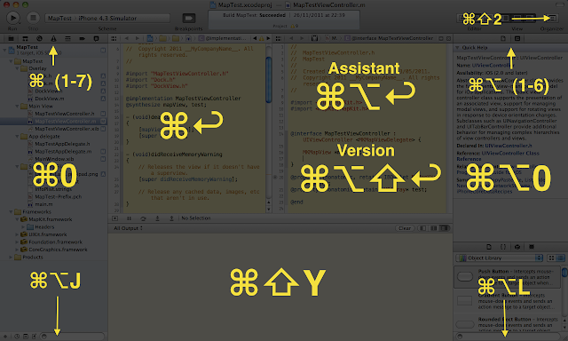

<h1 class="title">Optimise your Xcode productivity with shortcuts</h1>
<h2 class="subtitle"></h2>
2012-08-19

Xcode uses about as much screen real estate as [Queen Elizabeth II](http://www.businessinsider.com/worlds-biggest-landowners-2011-3?op=1) and one of it's largest elements is the     toolbar. This is fine on a large screen ,but if you are working on a laptop,then this is probably space you     would rather use for other things.

Spaaaaaaaaaaaaaaaace
The solution , learn the shortcuts and get rid of it. I found that the list of reasons to have it present is very short compared to the amount of space it occupies:
- Run : cmd + R
- Stop : cmd + .
- Standard editor : cmd + enter 
- Assistant Editor : cmd + alt + enter
- Show/hide debug area : cmd + shift + Y
- Show/hide navigator : cmd + 0
- Show/hide the utilities : cmd + alt + 0
The benefit to using these shortcuts is more than the removal of the space hogging toolbar , it is much easier and quicker to hit shortcut key combos than to reach for your mouse and move the cursor all the way to the relavant button to get things done. Don't need to see the assistant editor for this code file? cmd+enter and its gone,freeing more real estate for what you are working on. 
For the graphical thinkers,I found this neat info-graphic at [stackoverflow](http://stackoverflow.com/questions/5263703/xcode-4-most-useful-shortcut-keys) which is a great quick reference for the shortcuts you really need:

And if you want to know even more about shortcuts in Xcode 4,there is a [github repository](https://github.com/Machx/Xcode-Keyboard-Shortcuts) full of them.

---

*Originally posted on [Blogspot](https://divcode.blogspot.com/2012/08/optimise-your-xcode-productivity-with.html)*
